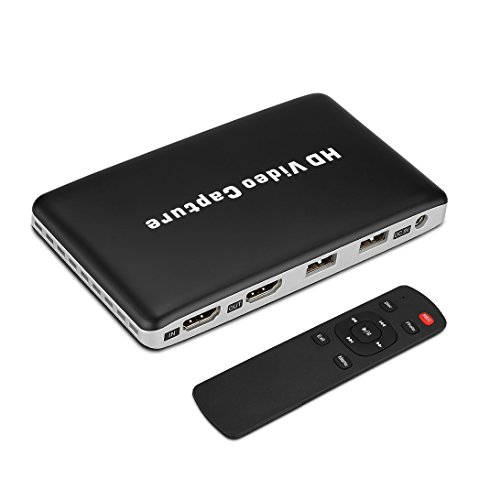
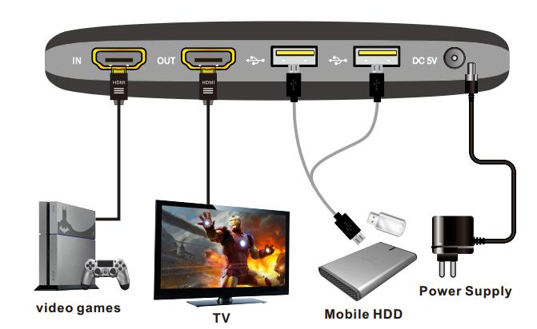
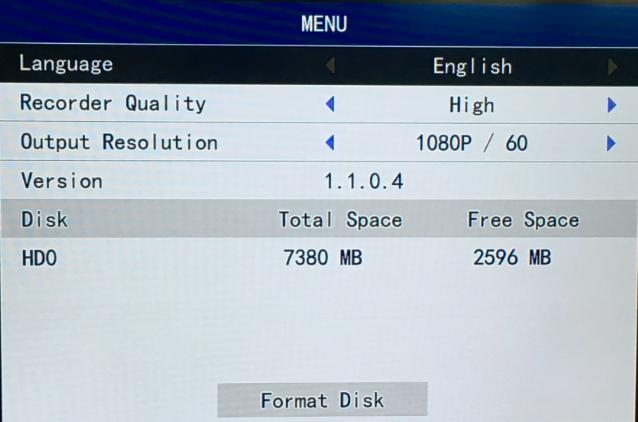

# HDV-UH50 Video Recorder Review

My VHS recorder finally died which, for a device working for more than two decades, is a testament to the durability of home appliances made in 1990's. This paved the way for the purchase of a new gadget :)

Whilst at the time, the 21-pin [SCART](https://en.wikipedia.org/wiki/SCART) cable was the best available in the consumer market, nowadays [HDMI](https://en.wikipedia.org/wiki/HDMI) became the *de facto* standard, allowing digital transmission of high definition content. We evolved from VHS tapes with a [335×576](https://en.wikipedia.org/wiki/VHS#Video_recording) resolution content to 1080×1920 or better nowadays, with an associated huge leap in quality.

So I started looking into the current market for this kind of device, and ended up ordering **HDV-UH50** on [AliExpress](https://www.aliexpress.com/) for €29.74 plus €0.69 (shipping costs) for a total of **€30.43**, which is several times cheaper than what I paid for my VHS recorder! It's funny there's almost no mention of the brand anywhere, apart for one line in its specifications mentioning the unknown *Feelworld*; even the box it comes in, and the device itself, are completely devoid of any branding!



Its power supply unit came with a US plug that won't fit in European outlets, so I had to use my travel universal adapter. It's quite easy to setup: just feed the video from the source ("video games" in the diagram) to the HDMI IN port, connect the HDMI OUT port to the monitor/TV, and insert a FAT32 formatted USB pen into one of the two USB 2.0 ports.



After turning it on, an OSD menu can be accessed by pressing the **Menu** button on the remote control. It looks like this:



The only parameter that affects the video encoding is the **Recorder Quality**, which can be switched between "Low", "Normal" and "High", so it's really limited.

So, what does the recording look like? Well, here's a sample:

<iframe width="560" height="315" src="https://www.youtube.com/embed/UuEw_uNCurA" frameborder="0" allow="accelerometer; autoplay; clipboard-write; encrypted-media; gyroscope; picture-in-picture" allowfullscreen></iframe>

The image is very crisp, without any blurriness or noticeable compression artifacts. And bear in mind this video was probably compressed two times: first in the capture device and then by YouTube. In particular, the MGMT videoclip portion surely had previous compressions applied to it before the rendering that was output to HDMI port.

And what about the encoding details of the generated video file? This is the output of running the [ffprobe](https://ffmpeg.org/ffprobe.html) utility:

```json
{
    "streams": [
        {
            "index": 0,
            "codec_name": "h264",
            "codec_long_name": "H.264 / AVC / MPEG-4 AVC / MPEG-4 part 10",
            "profile": "High",
            "codec_type": "video",
            "codec_time_base": "9271/500000",
            "codec_tag_string": "H264",
            "codec_tag": "0x34363248",
            "width": 1920,
            "height": 1080,
            "coded_width": 1920,
            "coded_height": 1088,
            "closed_captions": 0,
            "has_b_frames": 0,
            "pix_fmt": "yuv420p",
            "level": 42,
            "field_order": "progressive",
            "refs": 1,
            "is_avc": "false",
            "nal_length_size": "0",
            "r_frame_rate": "27/1",
            "avg_frame_rate": "250000/9271",
            "time_base": "9271/250000",
            "start_pts": 0,
            "start_time": "0.000000",
            "duration_ts": 5388,
            "duration": "199.808592",
            "bits_per_raw_sample": "8",
            "nb_frames": "5388",
            "disposition": {
                "default": 0,
                "dub": 0,
                "original": 0,
                "comment": 0,
                "lyrics": 0,
                "karaoke": 0,
                "forced": 0,
                "hearing_impaired": 0,
                "visual_impaired": 0,
                "clean_effects": 0,
                "attached_pic": 0,
                "timed_thumbnails": 0
            }
        },
        {
            "index": 1,
            "codec_name": "pcm_s16le",
            "codec_long_name": "PCM signed 16-bit little-endian",
            "codec_type": "audio",
            "codec_time_base": "1/24000",
            "codec_tag_string": "[1][0][0][0]",
            "codec_tag": "0x0001",
            "sample_fmt": "s16",
            "sample_rate": "24000",
            "channels": 2,
            "bits_per_sample": 16,
            "r_frame_rate": "0/0",
            "avg_frame_rate": "0/0",
            "time_base": "1/24000",
            "start_pts": 0,
            "start_time": "0.000000",
            "bit_rate": "768000",
            "nb_frames": "4795392",
            "disposition": {
                "default": 0,
                "dub": 0,
                "original": 0,
                "comment": 0,
                "lyrics": 0,
                "karaoke": 0,
                "forced": 0,
                "hearing_impaired": 0,
                "visual_impaired": 0,
                "clean_effects": 0,
                "attached_pic": 0,
                "timed_thumbnails": 0
            }
        }
    ],
    "format": {
        "filename": "REC_00000.avi",
        "nb_streams": 2,
        "nb_programs": 0,
        "format_name": "avi",
        "format_long_name": "AVI (Audio Video Interleaved)",
        "start_time": "0.000000",
        "duration": "199.808592",
        "size": "193965198",
        "bit_rate": "7766040",
        "probe_score": 100
    }
}
```

The video codec used is [H.264](https://en.wikipedia.org/wiki/Advanced_Video_Coding) and, though it was superseded by both [H.265](https://en.wikipedia.org/wiki/High_Efficiency_Video_Coding) and [H.266](https://en.wikipedia.org/wiki/Versatile_Video_Coding), it's massively popular, with most smartphones featuring hardware-accelerated H.264 decoding.

The decision to save uncompressed [PCM](https://en.wikipedia.org/wiki/Pulse-code_modulation) sound was probably due to implementation simplicity. But it gives you the chance to compress it afterwards exactly as you prefer, or to perform editing without impairing a quality loss, something that cannot be said regarding the video stream.

Finally, the container format could have been the popular [Matroska](https://en.wikipedia.org/wiki/Matroska) instead of [AVI](https://en.wikipedia.org/wiki/Audio_Video_Interleave), but this is really a minor detail.

A second experience would be to record directly from the cable TV set-top box, but it fails because the output is protected using [HDCP](https://en.wikipedia.org/wiki/High-bandwidth_Digital_Content_Protection). Fortunately, I have a device that strips the copy protection, and with that in between, here's the result:

<iframe width="560" height="315" src="https://www.youtube.com/embed/pXQyKJK5b_8" frameborder="0" allow="accelerometer; autoplay; clipboard-write; encrypted-media; gyroscope; picture-in-picture" allowfullscreen></iframe>

While the recording is done at 1080×1920, I'm still not sure if that's the original TV transmission resolution, or whether it was 720×1280 and then upscaled by the set-top box.

All-in-all, it does its job and, at this price, much more can't be asked. Possible improvements:
  * Do away with the power source, as it becomes cumbersome. If the DHCP removal device is added, it's even worse! But the mere 50mA available in the HDMI cable make this wish unrealistic.
  * It can only be used when really needed. If it's permanently connected, like the VCR recorders were at their heyday, it introduces some lag and seems to disable some image improvement processing performed by the TV.
  * The best interface would probably be a smartphone app capable of showing a preview, but the current button to start/stop recording is good enough.
